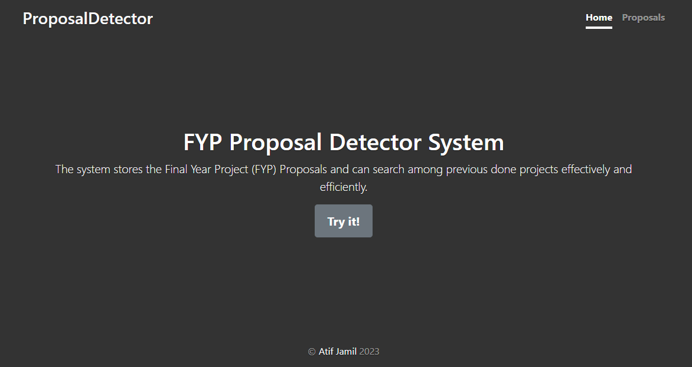
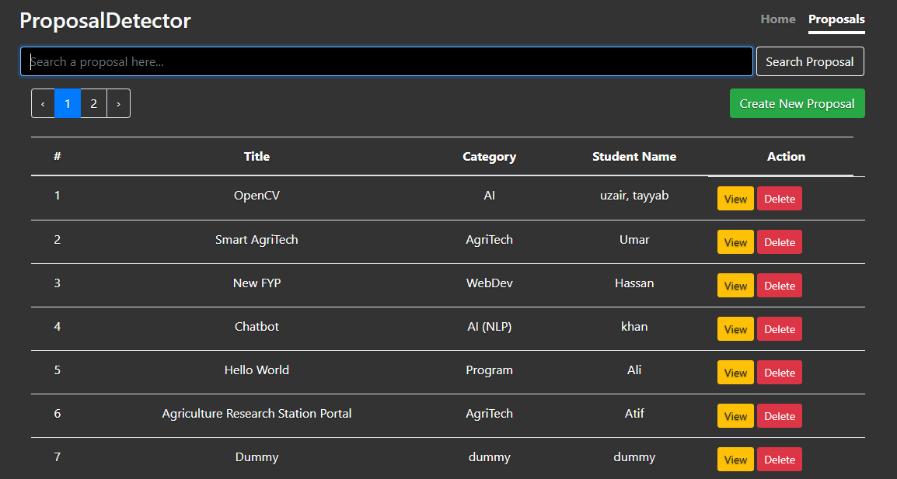
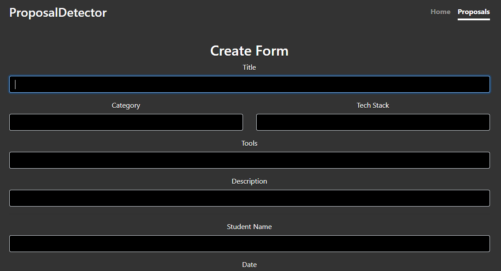
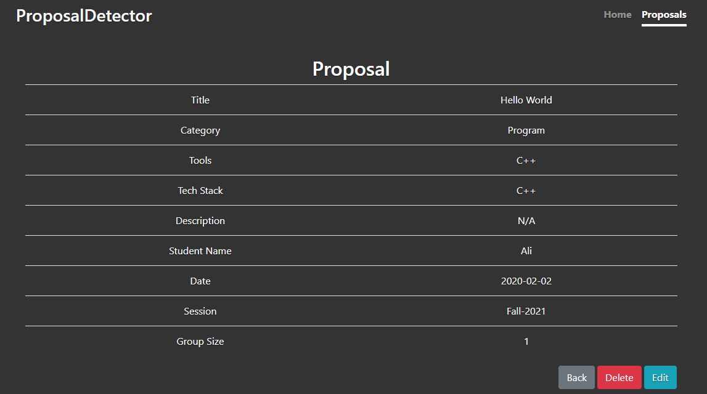
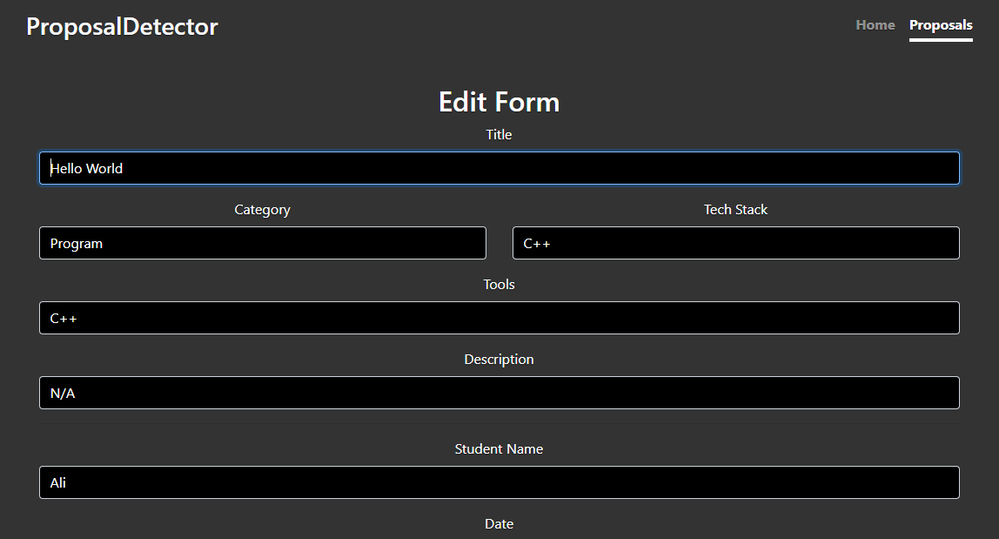

# ProposalDetector

This is a Final Year Project (FYP) Proposal Detector project developed using Laravel Framework of PHP with MySQL database.

## Working

Here, you can store the data of FYP Proposals and then in future, you would be able to search for the one to check if exist in the database system or not.

## Images

1. Home Page

2. Proposals Page

3. Last Page of Proposals

4. Create Page

5. View Page

6. Edit Page


## Installation

1) Install **PHP**

2) Install **Composer**

3) $ ```composer install```

4) Make a database for this project.

5) copy-paste (duplicate) **.env.example** file, rename it to **.env** and configure it.

6) $ ```php artisan migrate```

7) $ ```php artisan serve```

8) Visit ```localhost:8000``` in browser or any other port you have configured to see the final result.

9) (Optional) Click on **GENERATE APP KEY** if displayed.

## Technologies

- Backend: **Laravel (PHP)**

- Frontend: **Blade**

- Databse: **MySQL**

- IDE: **Visual Studio (VS) Code**

- DB Server: **XAMPP**

- Package Manager: **Composer**

- VCS: **Git**